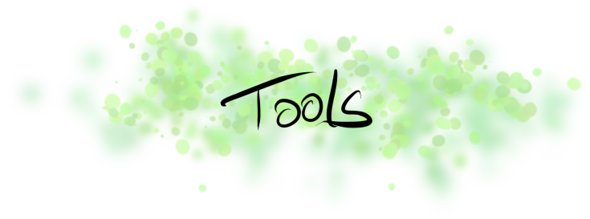
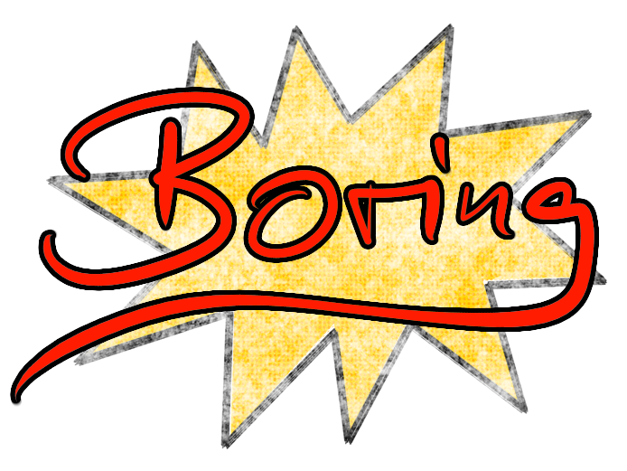

#

\setbeamertemplate{caption}{} <!-- Hide image caption -->


#

\setbeamertemplate{caption}{} <!-- Hide image caption -->


#


```json
{"title":  "jq, a JSON command line tool"
  ,"presenter"
    :{"first":"David","last":"Luposchainsky"
},"duration":"30 minutes"}
```
. . .

```bash
$ cat file | jq
```
. . .
```json
{
  "title": "jq, a JSON command line tool",
  "presenter": {
    "first": "David",
    "last": "Luposchainsky"
  },
  "duration": "30 minutes"
}
```

#

```json
{
  "title": "jq, a JSON command line tool",
  "presenter": {
    "first": "David",
    "last": "Luposchainsky"
  },
  "duration": "30 minutes"
}
```
. . .
```bash
$ cat file | jq '{ duration, name: .presenter | [.last, .first] }'
```
. . .
```json
{
  "duration": "30 minutes",
  "name": [
    "Luposchainsky",
    "David"
  ]
}
```


# How does it work?

- Access properties: `.user | .firstname`
- Build lists: `[.firstname, .lastname]`
- Iterate over lists: `.[]`
- Calculate properties: `[1, 2, 3] | length`

. . .

\setbeamertemplate{caption}{} <!-- Hide image caption -->



# Live coding!

```
curl 'https://api.github.com/repos/quchen/prettyprinter/issues?state=all&page=1&per_page=1000' > ~/temp/json
Direct output -> too long
jq type -> array
.[0]
.[0] | [.user.login, .title] -> Sample some data
.[] | [.user.login, .title] -> Sample all data
.[] | { name: .user.login, title: .title} -> Object is more appropriate
map({ name: .user.login, title: .title}) -> Refactor as map
map({ name: .user.login, title: .title} | "\(.name)’s ticket: \(.title)") -> Format nicely
map({ name: .user.login, title: .title} | "\(.name)’s ticket: \(.title)") | .[] -> Get entries
Add -r flag -> Output done
```
